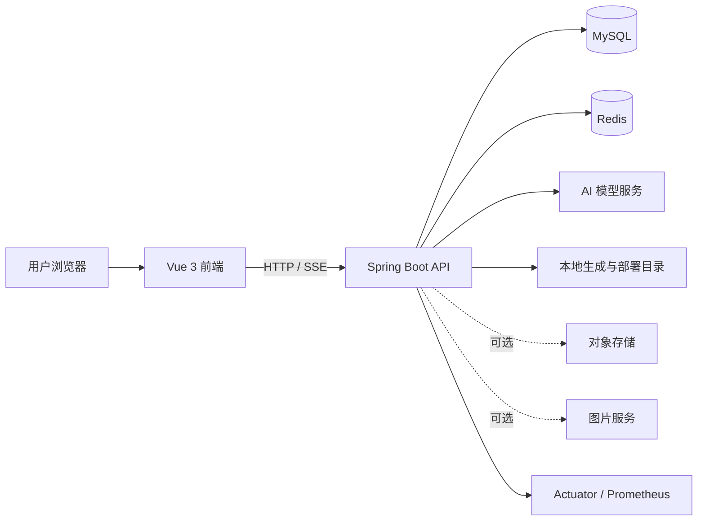

# 系统架构

## 总体视图

## 主要业务流

1. 用户创建应用并提交初始描述。
2. 后端记录应用和对话，并根据需求选择代码生成类型。
3. AI 生成过程通过 SSE 返回前端，生成文件由后端管理。
4. 前端加载静态资源路径进行预览，用户可继续对话迭代。
5. 部署时，后端生成唯一 `deployKey` 并对外提供对应资源。

## 单体版

根目录 `src/` 下是默认 Spring Boot 应用，包含用户、应用、对话、AI 生成、截图和静态资源访问等能力。

- 默认端口：`8123`
- API 前缀：`/api`
- 会话存储：Redis
- 业务数据：MySQL
- 数据访问：MyBatis-Flex
- 对外调用：OpenAI 兼容模型、DashScope、COS 与图片服务（按功能配置）

## 微服务版

`yu-ai-code-mother-microservice/` 是独立 Maven 多模块工程：

| 模块 | 职责 |
| --- | --- |
| `yu-ai-code-common` | 公共能力与通用约定 |
| `yu-ai-code-model` | 共享模型 |
| `yu-ai-code-client` | 服务间客户端接口 |
| `yu-ai-code-user` | 用户服务，HTTP `8124`、Dubbo `50051` |
| `yu-ai-code-app` | 应用与对话服务，HTTP `8125`、Dubbo `50053` |
| `yu-ai-code-ai` | AI 生成能力 |
| `yu-ai-code-screenshot` | 网页截图服务，HTTP `8127`、Dubbo `50052` |

微服务间通过 Dubbo 调用，并使用 Nacos 注册与发现。仓库当前没有一键编排文件，启动时需根据本地环境分别配置。

## 数据边界

`sql/create_table.sql` 定义了当前主要业务数据：

- `user`：用户账号、资料与角色。
- `app`：应用信息、生成类型、部署标识与所属用户。
- `chat_history`：按应用保存用户与 AI 消息。

## 安全边界

- 用户会话保存在 Redis，管理接口由后端进行角色校验。
- 生产环境应使用 HTTPS，并限制数据库、Redis、Nacos 和监控端点的访问范围。
- AI、COS 和图片服务凭据必须放在未跟踪的环境配置或密钥管理服务中。
- 生成内容属于不可信输入，公网部署前应进行隔离、内容检查与资源限制。
